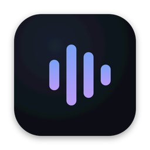
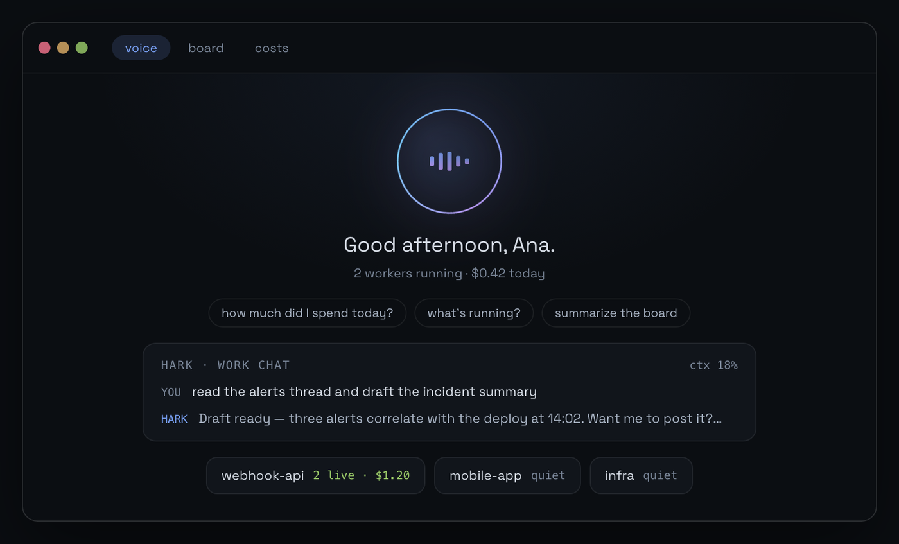
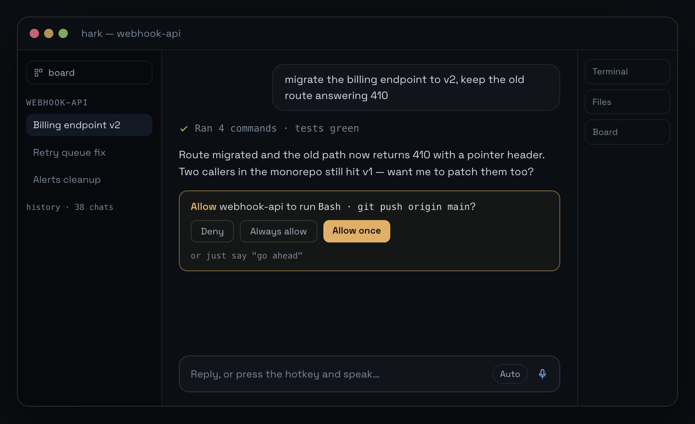
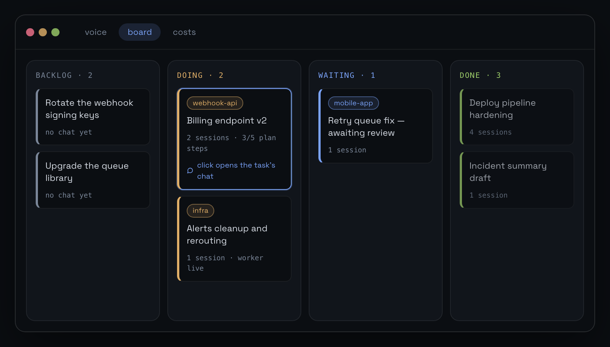
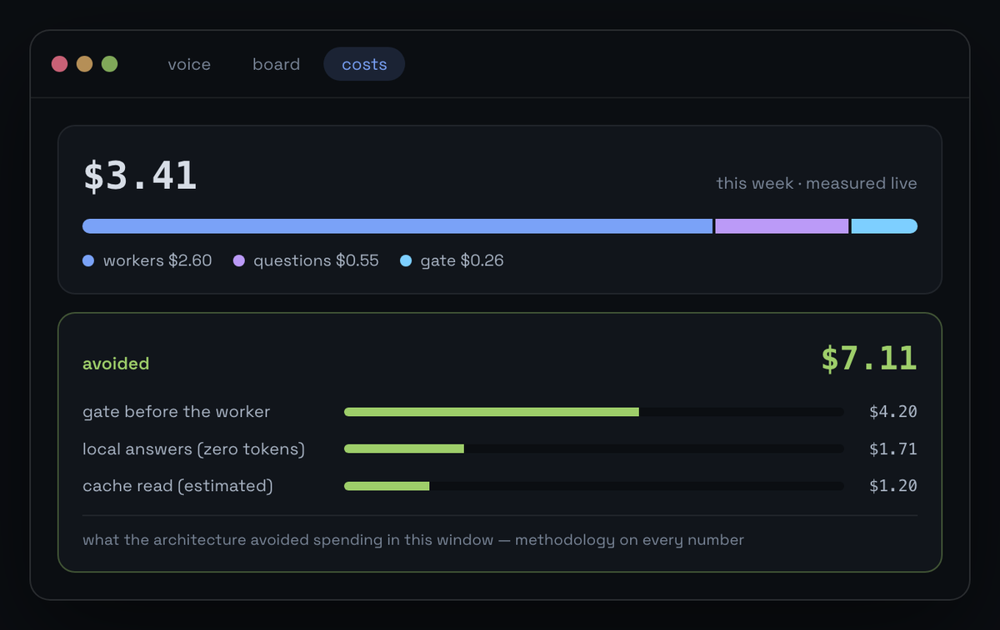

<div align="center">



# Hark

**One voice for every coding agent.**

[Install](#install) · [Usage](docs/USAGE.md) · [Configuration](docs/CONFIG.md) · [Plugins](docs/PLUGINS.md) · [Contributing](CONTRIBUTING.md) · [harkharness.web.app](https://harkharness.web.app)

[](https://github.com/harkharness/hark/releases/latest)
[](https://github.com/harkharness/hark/actions/workflows/test.yml)

[](#license)

</div>

Hark is a voice-first cockpit that sits on top of the agent CLIs you already pay
for. Ask what you were working on and hear the answer out loud. Dispatch real
work into your existing agent sessions — by voice or by text, across every
project on your disk — and watch it run in a window that reads like the terminal
you already know.

Hark never calls a model API behind your back. It drives the agent CLIs you
already have installed and authenticated — Claude Code natively, and Gemini CLI,
Codex or any other agent that speaks the
[Agent Client Protocol](https://agentclientprotocol.com) through one plugin — so
every token draws from the subscription you already pay for. No API key, no
second bill, no telemetry, no account.

Hark is open source under MIT or Apache-2.0. This repository holds the source,
the documentation and every release.

## Install

```bash
curl -fsSL https://harkharness.web.app/install.sh | bash
```

That picks the right build for your architecture, installs the `hark` CLI into
`~/.local/bin`, drops `hark.app` into `/Applications` and clears the quarantine
bit — the app is not code-signed yet, so macOS would otherwise refuse to open
it.

Prefer to click? Grab a `.dmg` from
[the latest release](https://github.com/harkharness/hark/releases/latest):

| File | For |
|---|---|
| `hark-app-aarch64-apple-darwin.dmg` | macOS, Apple Silicon (M1 and newer) |
| `hark-app-x86_64-apple-darwin.dmg` | macOS, Intel |
| `hark-cli-<target>.tar.gz` | the headless `hark` CLI on its own |

If you download the `.dmg` by hand, run `xattr -cr /Applications/hark.app` once
before opening it.

**You need:** macOS 12+, at least one supported agent CLI installed and logged
in — the [Claude Code CLI](https://code.claude.com) gets the richest experience;
[Gemini CLI](https://github.com/google-gemini/gemini-cli), Codex
(`@agentclientprotocol/codex-acp`) or any other ACP agent works through the ACP
plugin — and ~500MB of disk for the speech model. The first-run wizard checks
all of it, downloads the model and asks for the microphone once.

Linux is on the backlog — the voice layer leans on macOS-native pieces today.

### Build from source

You need the Xcode command line tools, Rust (stable; CI pins 1.98.0), Node 22
and npm.

```bash
git clone https://github.com/harkharness/hark && cd hark
npm install
npm run tauri dev                     # the desktop app, with hot reload
cargo build --release -p hark-cli     # the headless CLI
```

[CONTRIBUTING.md](CONTRIBUTING.md) covers the rest: tests, the project layout
and how a release is cut.

## What it looks like



**One window that is your assistant.** A persistent chat backed by a long-lived
Claude Code session with your full settings — MCP servers and tools included. It
has a name, a personality file it maintains itself, and it speaks its answers.
Cheap questions never reach it: they are answered from the local index for zero
tokens, or by a bare one-shot ask that costs cents.



**Project windows that read like Claude Code.** Full session history in the
sidebar, markdown transcripts with folded tool calls and grouped command bursts,
deliverable file cards, a CSV-as-table viewer, a real PTY terminal and a local
file editor. Every privileged tool call renders as an inline permission card you
can answer by click, keyboard or voice.



**A board where the cards are the sessions.** Demands live in columns; each card
carries the session that is doing the work, so "continue the webhook migration"
resumes the right conversation instead of starting a new one. Say it out loud
and Hark shows you the resolved target *before* anything runs.



**An honest ledger.** Every turn — including the failed ones — lands in a local
spend ledger. USD comes only from the CLI's own numbers, token counts come from
the session logs, and the two are never summed. The panel shows where the money
went, cache hit ratios and your subscription windows.

**A permission floor that does not move.** Commands that touch production —
`kubectl apply`, `terraform apply`, `helm`, force-push, destructive SQL, cloud
deletes, package publishes — are never auto-approved: standing rules are
ignored, the card turns red, and in bypass mode the infra CLIs are blocked
outright.

<sup>Interface mockups with synthetic data. The real windows carry your own
projects, sessions and spend.</sup>

## Token efficiency by design

Measured against `claude` v2.1.x on a real codebase:

| Path | Cost / turn |
|---|---|
| Lean ask (no tools, no settings, pre-cooked snapshot) | ~$0.009 |
| Default `claude -p` (memory file + MCP + tools) | $0.23+ |
| Worker turn with tools executing | $0.33+ |
| Resumed worker turn (prompt cache warm) | ~$0.001 |
| Lean ask over the Claude ACP adapter (`claude-agent-acp`, haiku) | ~$0.002 |

The architecture assumes tokens are the scarce resource:

- **Three answer layers.** Deterministic questions — the board, running workers,
  today's spend — are answered locally for zero tokens. Phrasing-only questions
  get a light model with ~1k of context. Only real reasoning pays full price.
- **A gate before the expensive path.** A cheap evaluator checks a dispatch
  against its target before a worker burns dollars on the wrong session.
- **Local-first everything.** Session history lives in a SQLite index built
  incrementally from the CLI's own logs. Recalling a chat, searching sessions,
  opening files and reading transcripts never touch a model.
- **Hard ceilings.** Every worker spawns with a dollar budget (default $2) so a
  runaway turn stops itself — as a CLI flag on Claude Code, and as Hark's own
  cancel on every ACP agent, which has no such flag.
- **Model routing.** The tier is chosen from what you actually asked for, not
  from a global default — and said in each agent's own model names, so one
  window default drives a Claude chat and a Gemini chat alike.

## How it is built

Hexagonal (ports and adapters), with a functional core and an imperative shell:

```
crates/hark-core           all logic, no UI
  src/domain/              pure functions and immutable types, no I/O
  src/ports/               traits: Stt, Tts, AgentRunner, SessionStore, SpendLedger…
  src/adapters/            thin shells: sqlite, whisper, cpal, say, pty
crates/hark-agent          the plugin contract: an event vocabulary + a capability sheet
crates/hark-plugin-claude  the Claude Code backend
crates/hark-plugin-acp     every Agent Client Protocol backend
crates/hark-cli            headless driver: hark ask / dispatch / spend
src-tauri + src/           the desktop app (Tauri v2 + React)
```

Domain code is test-driven and runs without a microphone, a database or a
network. The voice pipeline is local: whisper.cpp (Metal) for speech to text,
the system `say` voice for text to speech.

## Documentation

| | |
|---|---|
| [Usage](docs/USAGE.md) | First run, the voice loop, dispatch, permissions, the board, the CLI |
| [Configuration](docs/CONFIG.md) | Every key in `config.toml`, with defaults |
| [Plugins](docs/PLUGINS.md) | How agent backends plug in, what ships today, what comes next |
| [Troubleshooting](docs/TROUBLESHOOTING.md) | Gatekeeper, microphone, missing CLI, uninstall |
| [Plugin contract](docs/PLUGIN-CONTRACT.md) | For backend authors: events, capabilities, the registry, handoff |
| [Frontend](docs/FRONTEND.md) · [Chrome](docs/CHROME.md) | For contributors: how the React side is built and its visual grammar |

## Plugins, and where this is going

Hark is a cockpit, not an agent. The agent is a **plugin** behind a small
contract: an event vocabulary (assistant text, tool calls, permission requests,
turn results with cost) plus a capability sheet the UI degrades against. Two
plugins speak for every agent today:

- **Claude Code**, natively — the `claude` CLI with your full settings, MCP
  servers, memory file and session history on disk.
- **The ACP plugin** — any agent that speaks the Agent Client Protocol:
  Gemini CLI, Codex, Claude Code over ACP, DeepSeek, Kiro, Google Antigravity
  ship as registry lines, and any other ACP agent is one line of config away.

Settings → Plugins is the catalog: what is installed, what each plugin can do,
which build is on your machine against what the ACP registry publishes (with
the update command when yours is behind), and what each agent calls the model
tiers. The cockpit does not thin out when the agent changes: Hark keeps a
history for agents that leave none on disk, prices every turn an agent reports
and shows an honest dash where it does not, applies the same production floor
to every one of them, and hands a thread from one agent to another mid-task
("switch this chat to Gemini") with a local brief. What a plugin cannot do
stays on screen, disabled, with the reason — never hidden.

The contract lives in [`crates/hark-agent`](crates/hark-agent), so anyone can
write a backend for the agent CLI their company allows. That is the whole
thesis: the workflow belongs to the developer, the vendor is a plugin, and the
cost ledger is the one neutral ruler across all of them.

## Privacy

- Hark makes **one network call of its own**: an update check against this
  repository's releases (a plain GET, nothing identifying sent;
  `auto_update = false` turns it off). Updates install only when you click
  restart. Everything else runs through the agent CLI you chose, under your own
  account.
- The speech model runs **locally**; audio never leaves the machine.
- The local index and the spend ledger contain fragments of your prompts and
  session titles. They live in your user data directory and stay there.
- No telemetry, no analytics, no account, nothing phones home.

## FAQ

**Does it use my subscription?** Yes — that is the point. Hark shells out to
the agent binaries you already authenticated — `claude`, `gemini`, `codex-acp`
and so on. It has no API key and cannot bill you separately.

**Do I need to change how I work?** No. Hark reads the sessions the CLI already
writes to disk, honours your existing settings, memory file, MCP servers and
skills, and hands the same sessions back. Close Hark and your terminal
workflow is exactly where you left it. Agents that keep no session file get one
written by Hark, so their chats are searchable and resumable inside Hark too.

**Is it free?** Yes. Hark is open source under MIT or Apache-2.0 and costs
nothing beyond the agent subscriptions you already have.

## Contributing

Bug reports, agent registry lines, translations, docs and code are all welcome.
Start with [CONTRIBUTING.md](CONTRIBUTING.md); report vulnerabilities privately
as described in [SECURITY.md](SECURITY.md). Everyone taking part follows the
[code of conduct](CODE_OF_CONDUCT.md).

## Releases

Every tag builds both macOS architectures and publishes to
[Releases](https://github.com/harkharness/hark/releases). Asset names carry no
version, so `releases/latest/download/<name>` links keep working forever.
Report a problem or ask for something in
[Issues](https://github.com/harkharness/hark/issues).

## License

Licensed under either of [Apache License, Version 2.0](LICENSE-APACHE) or
[MIT license](LICENSE-MIT) at your option.

Unless you explicitly state otherwise, any contribution intentionally submitted
for inclusion in Hark by you, as defined in the Apache-2.0 license, shall be
dual licensed as above, without any additional terms or conditions.

<sub>Hark is an independent project, not affiliated with or endorsed by
Anthropic, Google or OpenAI. Claude Code, Gemini CLI and Codex are trademarks
of their respective owners.</sub>
